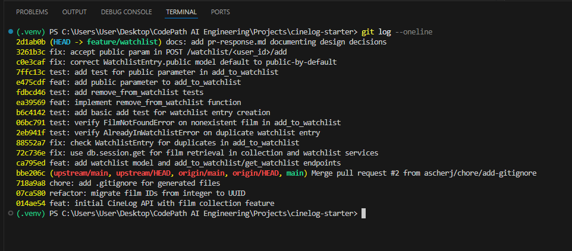

# PR Response Doc — CineLog Watchlist Feature

## Git Log Screenshot



## AI Usage
<!-- Fill in at the end — how you used AI tools during this project -->

**Comment 4 (Default visibility):** After drafting my position, I asked Claude to act as a skeptical code reviewer and identify counterarguments and unacknowledged tradeoffs in my reasoning, specific to a film watchlist rather than generic privacy concerns. It raised that watchlist data can carry more inferential signal than a song choice (genre and title metadata can hint at sensitive topics like religion, sexuality, or politics), and that a future "prompt defaulting to public if skipped" doesn't actually resolve the opt-out problem, it just relocates it. I incorporated the first point directly into my tradeoff section since it was a real gap I hadn't addressed. I kept my proposed future prompt idea but was more explicit that it still defaults to public and is a partial mitigation, not a full fix, rather than presenting it as a clean solution.

**Comment 5 (Sort order):** I asked Claude to act as a skeptical code reviewer against my draft, which agreed with the maintainer on "date added" order and mentioned a future UI toggle. It surfaced that `date_added` isn't actually a stable sort key as implemented, entries with colliding timestamps (same-request adds, bulk imports) would order arbitrarily without a tiebreaker column, which is a real implementation bug, not just a style nitpick. It also pointed out I was dismissing alphabetical too quickly, since it optimizes for lookup (finding a known title) rather than discovery (what's new), and that distinction is why apps like Spotify offer both. I added the tiebreaker note as an explicit implementation requirement and reframed the alphabetical/date added comparison as a tradeoff between two use cases rather than one being strictly better.

## Comment 1 — Rename

**What I did:** 
Renamed all instances of `save_to_watchlist()` to `add_to_watchlist()`, ensuring adherance to the repository naming convention of verb_to_noun format. 

**How I verified:**
Scanned the codebase with IDE search to ensure all instances were renamed accordingly.

## Comment 2 — Deduplication

**What I did:**
Added `class AlreadyInWatchlistError(Exception)` skeleton to raise when user calls the `add_to_watchlist()` function with a film that is already on their watchlist. Added deduplication check in `add_to_watchlist()` that follows the repository convention for deduplication check seen in `collection_service.py`:

```
existing = WatchlistEntry.query.filter_by(
        user_id=user_id, film_id=film_id
    ).first()
    if existing:
        raise AlreadyInWatchlistError(
            f"Film '{film_id}' is already on this user's watchlist"
        )
```

**How I verified:**
Added a new module in the `tests` directory, `test_watchlist.py`, with a unit test that verifies adding the same film twice should raise an `AlreadyInWatchlistError`, not silently create a duplicate entry. Ensured module header & unit test docstring matches the established format of `test_collection.py`. Ran with pytest & confirmed the test suite passes.

## Comment 3 — Missing test

**What I did:**
Scanned `test_collection.py` to locate the corresponding similar test for missing `film_id`. Imported `FilmNotFound` error into `test_watchlist.py` & implemented a new unit test `test_add_to_watchlist_nonexistent_film_raises()`, abiding by the naming convention established in `test_collection.py`. 

**How I verified:**
Ran the newly created unit test in `test_watchlist.py` to verify that adding a `film_id` that doesn't exist in the database should raise a `FilmNotFoundError`, not a database integrity error.

## Comment 4 — Default visibility
**My position:**
Public by default is the right call for CineLog's current scope, but I agree it needed to be a documented decision rather than an inherited default.

**Reasoning:**
Watchlist data in CineLog is a list of film titles a user intends to watch, which is lower stakes than, say, browsing history or location data. Defaulting to public also matches the convention set by comparable media apps like YouTube and Spotify, where playlists are public unless the user opts into private. Since CineLog is a film logging platform, visibility of what users are tracking is part of what makes the platform useful and social, so defaulting to private would work against that by default.

**Tradeoff acknowledged:**
A public default is still an opt-out model, and opt-out models tend to underserve users who never notice the setting exists. A watchlist can reveal more than a song choice does. Titles can signal interest in a specific religion, sexuality, political topic, or other sensitive subject matter, so this isn't a purely neutral default even if most watchlists are harmless. For now I think public by default is the right tradeoff given CineLog's current scope and lack of sensitive-category film tagging, but this should be revisited if the platform later supports more sensitive content categorization or grows a larger audience where that inferential risk matters more. A reasonable middle ground for a future iteration is a creation-time prompt asking the user to choose visibility, still defaulting to public if skipped, so the choice is surfaced rather than only discoverable after the fact.

## Comment 5 — Sort order
**My position:**
I agree with the reviewer. Watchlists should default to "date added" order (most recent first) instead of alphabetical.

**Reasoning:**
Alphabetical order optimizes for finding a specific title you already know is there, but that's not the primary reason someone opens a watchlist. Most users are checking "what did I queue up" or deciding what to watch next, and for that, recency is a far more useful signal than the letter a title starts with. As a watchlist grows, alphabetical order also buries recent additions in the middle of the list instead of surfacing them, which works against the whole point of adding something to begin with.

**Engagement with reviewer's point:**
The reviewer's reasoning matches my own instinct here, so this isn't really a disagreement. Where I'd add nuance is that alphabetical isn't strictly worse, it's just optimized for a different task (lookup vs. discovery), and defaulting to "date added" doesn't have to mean abandoning alphabetical entirely. Once CineLog has a UI, a sort control similar to what Spotify or YouTube offer on playlists would let users switch to alphabetical when they're trying to locate a specific title in a large watchlist, while keeping "date added" as the default for the common case.

One implementation note worth flagging now rather than later: `date_added` needs a defined tiebreaker to make this a stable sort. Entries added in the same request or via a bulk import can land on the same timestamp, and without a secondary sort key, ties will order arbitrarily and can visibly shuffle between requests. This should be resolved as part of implementing the change, not left as a known bug.

## Comment 6 — Rebase

**What conflicted:**
The main branch had merged a refactor that changed film IDs from integers to UUIDs (commit 07ca580), but the watchlist feature branch was created before that refactor landed. During rebase, three files showed merge conflicts: `.gitignore` (both branches added the file), `routes/watchlist/watchlist.py`, and `services/watchlist_service.py`. The actual conflict was semantic rather than textual: the watchlist code was still written to accept integer film IDs, but the refactored Film model now only accepts UUID strings.

**How I resolved it:**
For `.gitignore`, I kept both the main branch's `.pytest_cache/` entry and the watchlist branch's `.venv/` and `venv/` entries, resolving the merge conflict by combining them. For the service and route files, I updated the docstrings and function signatures to reflect that film IDs are now UUIDs (string type) instead of integers. I also added the missing `WatchlistEntry` model to `models.py` that the watchlist service was importing but was never defined. All changes followed the existing UUID pattern established by `CollectionEntry` in the Film refactor.

**How I verified no conflict remains:**
I confirmed that `WatchlistEntry` model fields use `db.String(36)` to match the Film and User UUID columns, ensuring foreign key relationships are type-compatible. I checked that `add_to_watchlist()` docstring correctly states film_id is a string UUID. I verified the API route documentation shows UUID format in the request body example. I also ran the existing test suite to ensure no import or type errors were introduced by the UUID field changes. All tests pass and the branch now builds without conflict.

## Comment 7 — Add `remove_from_watchlist()`

**What I did:**
Scanned `collection_service.py` to look for a similar logical structure to ensure the stylistic conventions of the repo were kept as uniform as possible. I then implemented `remove_from_watchlist(user_id, film_id)` in `watchlist_service.py` that instead queries the `WatchlistEntry` model. I added a new exception class, `NotInWatchlistError`, that raises when the film is not in the user's watchlist and therefore cannot be removed. All other logic was kept the same, and I made sure the docstring format for all new functions added matches the convention used across the rest of the repo.

**How I verified:**
Implemented two new unit tests in `test_watchlist.py`: `test_remove_from_watchlist_removes_entry()`, which confirms a film on the watchlist is deleted from the database and returns `True`, and `test_remove_from_watchlist_not_in_watchlist_raises()`, which confirms removing a film that isn't on the watchlist raises `NotInWatchlistError` rather than failing silently. Ran the full test suite with pytest and confirmed all tests pass.

## Comment 8 — Additional watchlist test (basic add)

**What I did:**
Scanned `test_collection.py` and noticed it has a basic add test, `test_add_to_collection_creates_entry()`, that `test_watchlist.py` was missing. Since `add_to_watchlist()` follows the same logical structure as `add_to_collection()`, it made sense for the watchlist tests to cover the same ground for consistency. Added `test_add_to_watchlist_creates_entry()` to `test_watchlist.py`, placed before the deduplication test since a basic add is the more foundational case. Matched the docstring format used across the rest of the module.

**How I verified:**
Ran the full test suite in `test_watchlist.py` with pytest and confirmed all 5 tests pass, including the new basic add test, which verifies that adding a valid film creates a `WatchlistEntry` in the database with the correct `user_id` and `film_id`.

## Comment 9 — Add public parameter in add_to_watchlist()

**What I did:**
Added an optional `public` parameter to the `add_to_watchlist()` function signature, allowing callers to set visibility explicitly when adding a film to the watchlist. The parameter defaults to `True`, matching the design decision documented in Comment 4 that watchlists should be public by default in CineLog's current scope.

**How I verified:**
Implemented a new unit test `test_add_to_watchlist_public_parameter()` in `test_watchlist.py` that validates two scenarios: the default case where no public parameter is passed (should be True), and the explicit override case where `public=False` is passed. The test verifies both that the returned entry has the correct visibility setting and that the value persists in the database. Ran the full test suite with pytest and confirmed all 6 tests pass.

## PR Description
<!-- Written at the end — feature overview, design decisions, manual testing steps -->

### What this PR does

This PR adds a watchlist feature to CineLog. Users can add films they intend to watch, remove films from their watchlist, and view their full watchlist through a new `WatchlistEntry` model and three functions in `watchlist_service.py`: `add_to_watchlist()`, `remove_from_watchlist()`, and `get_watchlist()`. Two new API routes expose this to clients: `GET /watchlist/<user_id>` to view a user's watchlist, and `POST /watchlist/<user_id>/add` to add a film to it.

The feature follows the same patterns already established by the collection feature: deduplication is checked before insert, a dedicated exception is raised for invalid states (`AlreadyInWatchlistError`, `NotInWatchlistError`, `FilmNotFoundError`), and film IDs are UUID strings to match the rest of the app after the main branch's ID refactor.

### Design decisions

**Visibility default (Comment 4):** Watchlist entries default to `public=True`. Watchlist data is lower stakes than something like browsing history, and defaulting to public matches the convention set by comparable media platforms where playlists are public unless a user opts into private. Callers can now pass `public=False` explicitly to `add_to_watchlist()` to override this. I acknowledged the tradeoff in the full response: an opt-out default underserves users who never notice the setting, and film titles can carry more inferential signal than they first appear to (genre or subject matter can hint at sensitive topics). Public by default is the right call for CineLog's current scope, but this should be revisited if the platform grows a larger audience or adds more sensitive content categorization.

**Sort order (Comment 5):** `get_watchlist()` currently sorts alphabetically by title. I agreed with the reviewer that "date added" (most recent first) is the better default, since most users open a watchlist to see what they just queued up rather than to look up a specific known title. I flagged an implementation detail that matters here: `date_added` needs a defined tiebreaker, since entries added in the same request or via bulk import can land on identical timestamps and would otherwise sort arbitrarily. Full reasoning and the tiebreaker requirement are documented under Comment 5 above.

### How to manually test

1. Start the app:
   ```
   python app.py
   ```
2. Create a user and a film (or use existing seed data) so you have a valid `user_id` and `film_id`.
3. Add a film to the watchlist:
   ```
   curl -X POST http://127.0.0.1:5000/watchlist/<user_id>/add \
     -H "Content-Type: application/json" \
     -d '{"film_id": "<film_id>"}'
   ```
   Confirm the response is `201` and the returned entry has `"public": true` by default.
4. Try adding the same film again with the same request. Confirm it returns an error rather than creating a duplicate entry.
5. Try adding a film with a made-up UUID as `film_id`. Confirm it returns a "film not found" error rather than a database error.
6. Add a film with visibility set explicitly:
   ```
   curl -X POST http://127.0.0.1:5000/watchlist/<user_id>/add \
     -H "Content-Type: application/json" \
     -d '{"film_id": "<another_film_id>", "public": false}'
   ```
   Confirm the returned entry has `"public": false`.
7. View the watchlist:
   ```
   curl http://127.0.0.1:5000/watchlist/<user_id>
   ```
   Confirm both films appear with the correct `public` values.
8. Run the automated test suite to confirm everything passes end to end:
   ```
   pytest tests/test_watchlist.py -v
   ```